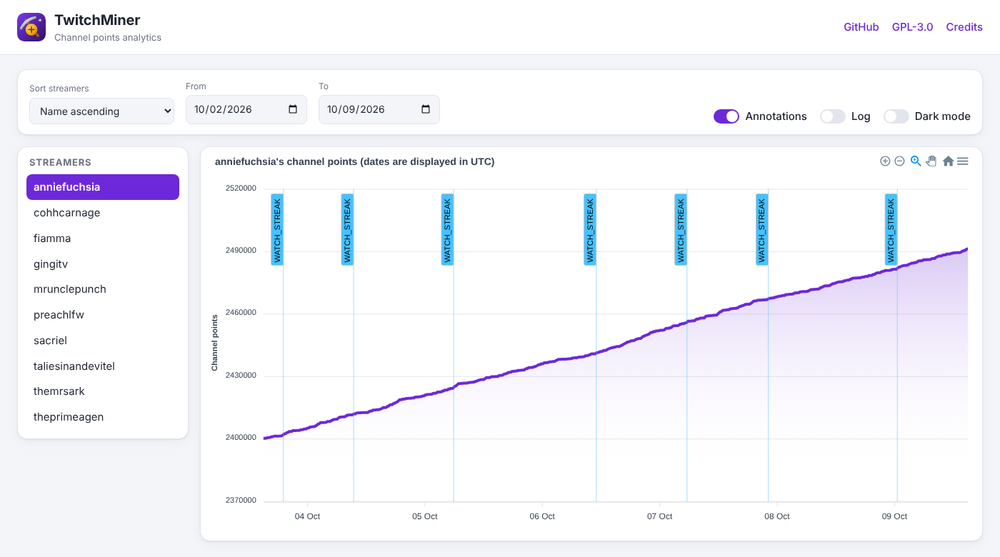
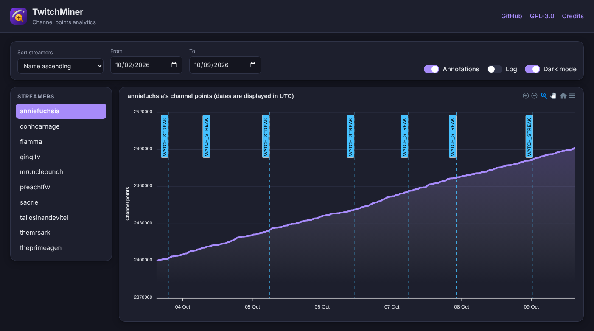

<p align="center">

</p>

<h1 align="center">TwitchMiner</h1>

<p align="center"><em>formerly Twitch Channel Points Miner v2</em></p>

<p align="center">
<a href="https://github.com/Poag/TwitchMiner/releases"></a>
<a href="https://github.com/Poag/TwitchMiner/stargazers"></a>
<a href="https://github.com/Poag/TwitchMiner/blob/main/LICENSE"></a>
<a href="https://github.com/Poag/TwitchMiner"></a>
</p>

> A script that watches streams for you and earns the channel points. It waits for a streamer to go live (+_450 points_ when the stream starts), clicks the bonus button (_+50 points_), follows raids (_+250 points_), claims drops and moments, and keeps the watch streak going.

Read more about the channel points [here](https://help.twitch.tv/s/article/channel-points-guide).

**TwitchMiner** is a fork of Twitch Channel Points Miner v2. It is configured entirely through **environment variables**, keeps all of its data in **one mountable folder**, claims each drop **only once**, and ships as a multi-arch Docker image. Betting / predictions have been **removed**. See [What's different in this fork](#whats-different-in-this-fork).

## Credits and license
This project is free software under the **GNU General Public License v3.0** (see [LICENSE](LICENSE)). It is a modified version of a chain of GPL-3.0 projects, and keeps their copyright notices and license:

- Original idea and code: [gottagofaster236/Twitch-Channel-Points-Miner](https://github.com/gottagofaster236/Twitch-Channel-Points-Miner)
- v2 rewrite: [Tkd-Alex/Twitch-Channel-Points-Miner-v2](https://github.com/Tkd-Alex/Twitch-Channel-Points-Miner-v2)
- Fork this one is based on: [rdavydov/Twitch-Channel-Points-Miner-v2](https://github.com/rdavydov/Twitch-Channel-Points-Miner-v2)
- This fork, **TwitchMiner**: [Poag/TwitchMiner](https://github.com/Poag/TwitchMiner)

As the GPL requires, any copy or modification you distribute must stay under the GPL-3.0 with its source available. The changes made in this fork are in the git history. The icon in `assets/icon.svg` is new in this fork and is released under the same license.

# README Contents
1. 🚀 [What's different in this fork](#whats-different-in-this-fork)
2. 🧾 [Logs feature](#logs-feature)
    - [Full logs](#full-logs)
    - [Less logs](#less-logs)
    - [Final report](#final-report)
3. 🧐 [How to use](#how-to-use)
    - [Data folder](#data-folder)
    - [Cloning](#by-cloning-the-repository)
    - [Docker](#docker)
    - [Limits](#limits)
4. 🔧 [Settings](#settings)
5. 📈 [Analytics](#analytics)
6. 🍪 [Migrating from an old repository](#migrating-from-an-old-repository-the-original-one)
7. 🪟 [Windows](#windows)
8. 📱 [Termux](#termux)
9. ⚠️ [Disclaimer](#disclaimer)

If you want to help, please leave a star 🌟 and read [CONTRIBUTING.md](CONTRIBUTING.md) before opening a pull request.

## What's different in this fork
**Added in this fork**
- Configuration through `TCPM_*` environment variables (no `run.py` to edit), with an [`.env.example`](.env.example)
- A single data folder (`TCPM_DATA_DIR`) holding cookies, the drops database, logs and analytics, so Docker needs one volume
- Each drop is claimed **once only**: attempts are stored in a small per-account database, so a failing claim is never retried and re-notified
- Drops for a game whose account is **not connected** are skipped, with a warning once a day that includes a countdown to the end of the campaign
- Multi-arch (`amd64` and `arm64`) images on GHCR, built on native runners, with `latest` on `main`, version tags and a monthly rebuild for security updates
- Lower idle CPU and memory use (no busy IRC loop, in-memory analytics writes, lazy pandas import, no needless drops polling)
- Smaller image on a current base (Python 3.12 slim, no compilers needed)

**Removed in this fork**
- Betting / predictions and all of their settings, events and colours
- `run.py` / `example.py` configuration, the Docker Hub image, `arm/v7` builds and the upstream badge workflows

**Inherited from the upstream projects**
- Improved logging: emojis, colors, files and much more
- Final report with all the data
- Automatic downloading of the list of followers and using it as an input
- Better 'Watch Streak' strategy in the priority system [#11](https://github.com/Tkd-Alex/Twitch-Channel-Points-Miner-v2/issues/11)
- Auto claiming [game drops](https://help.twitch.tv/s/article/mission-based-drops) from the Twitch inventory [#21](https://github.com/Tkd-Alex/Twitch-Channel-Points-Miner-v2/issues/21)
- Switchable analytics chart that shows the progress of your points [#96](https://github.com/Tkd-Alex/Twitch-Channel-Points-Miner-v2/issues/96)
- Joining the IRC Chat to increase the watch time and get StreamElements points [#47](https://github.com/Tkd-Alex/Twitch-Channel-Points-Miner-v2/issues/47)
- [Moments](https://help.twitch.tv/s/article/moments) claiming [#182](https://github.com/rdavydov/Twitch-Channel-Points-Miner-v2/issues/182)
- Notifying on `@nickname` mention in the Twitch chat [#227](https://github.com/rdavydov/Twitch-Channel-Points-Miner-v2/issues/227)
- Notifications to Telegram, Discord, Matrix, Pushover, Gotify and generic webhooks

## Logs feature
### Full logs
```
%d/%m/%y %H:%M:%S - INFO - [run]: 💣  Start session: '9eb934b0-1684-4a62-b3e2-ba097bd67d35'
%d/%m/%y %H:%M:%S - INFO - [run]: 🤓  Loading data for x streamers. Please wait ...
%d/%m/%y %H:%M:%S - INFO - [set_offline]: 😴  Streamer(username=streamer-username1, channel_id=0000000, channel_points=67247) is Offline!
%d/%m/%y %H:%M:%S - INFO - [set_offline]: 😴  Streamer(username=streamer-username2, channel_id=0000000, channel_points=4240) is Offline!
%d/%m/%y %H:%M:%S - INFO - [set_offline]: 😴  Streamer(username=streamer-username3, channel_id=0000000, channel_points=61365) is Offline!
%d/%m/%y %H:%M:%S - INFO - [set_offline]: 😴  Streamer(username=streamer-username4, channel_id=0000000, channel_points=3760) is Offline!
%d/%m/%y %H:%M:%S - INFO - [set_online]: 🥳  Streamer(username=streamer-username, channel_id=0000000, channel_points=61365) is Online!
%d/%m/%y %H:%M:%S - INFO - [on_message]: 🚀  +12 → Streamer(username=streamer-username, channel_id=0000000, channel_points=61377) - Reason: WATCH.
%d/%m/%y %H:%M:%S - INFO - [on_message]: 🚀  +12 → Streamer(username=streamer-username, channel_id=0000000, channel_points=64218) - Reason: WATCH.
%d/%m/%y %H:%M:%S - INFO - [on_message]: 🚀  +12 → Streamer(username=streamer-username, channel_id=0000000, channel_points=64230) - Reason: WATCH.
%d/%m/%y %H:%M:%S - INFO - [claim_bonus]: 🎁  Claiming the bonus for Streamer(username=streamer-username, channel_id=0000000, channel_points=64230)!
%d/%m/%y %H:%M:%S - INFO - [on_message]: 🚀  +60 → Streamer(username=streamer-username, channel_id=0000000, channel_points=64290) - Reason: CLAIM.
%d/%m/%y %H:%M:%S - INFO - [on_message]: 🚀  +12 → Streamer(username=streamer-username, channel_id=0000000, channel_points=64326) - Reason: WATCH.
%d/%m/%y %H:%M:%S - INFO - [on_message]: 🚀  +400 → Streamer(username=streamer-username, channel_id=0000000, channel_points=64326) - Reason: WATCH_STREAK.
%d/%m/%y %H:%M:%S - INFO - [claim_bonus]: 🎁  Claiming the bonus for Streamer(username=streamer-username, channel_id=0000000, channel_points=64326)!
%d/%m/%y %H:%M:%S - INFO - [on_message]: 🚀  +60 → Streamer(username=streamer-username, channel_id=0000000, channel_points=64386) - Reason: CLAIM.
%d/%m/%y %H:%M:%S - INFO - [on_message]: 🚀  +12 → Streamer(username=streamer-username, channel_id=0000000, channel_points=64398) - Reason: WATCH.
%d/%m/%y %H:%M:%S - INFO - [update_raid]: 🎭  Joining raid from Streamer(username=streamer-username, channel_id=0000000, channel_points=64398) to another-username!
%d/%m/%y %H:%M:%S - INFO - [on_message]: 🚀  +250 → Streamer(username=streamer-username, channel_id=0000000, channel_points=6845) - Reason: RAID.
%d/%m/%y %H:%M:%S - INFO - [claim_drop]: 📦  Claim Skin Chest x1 (Skin Chest (10 Skins) x1) 120/120 (100%)
%d/%m/%y %H:%M:%S - WARNING - [__warn_account_not_connected]: 🔗  Drops available for Elim but your account is not connected to the game, not claiming - campaign ends in 3d 4h 12m. Connect it at https://www.twitch.tv/drops/inventory
```
### Less logs
```
%d/%m %H:%M:%S - 💣  Start session: '9eb934b0-1684-4a62-b3e2-ba097bd67d35'
%d/%m %H:%M:%S - 🤓  Loading data for 13 streamers. Please wait ...
%d/%m %H:%M:%S - 😴  streamer-username1 (xxx points) is Offline!
%d/%m %H:%M:%S - 😴  streamer-username2 (xxx points) is Offline!
%d/%m %H:%M:%S - 😴  streamer-username3 (xxx points) is Offline!
%d/%m %H:%M:%S - 😴  streamer-username4 (xxx points) is Offline!
%d/%m %H:%M:%S - 🥳  streamer-username (xxx points) is Online!
%d/%m %H:%M:%S - 🚀  +12 → streamer-username (xxx points) - Reason: WATCH.
%d/%m %H:%M:%S - 🍀  Place 5k channel points on: SI (BLUE), Points: 848k, Users: 190 (70.63%), Odds: 1.24 (80.65%)
%d/%m %H:%M:%S - 🚀  +12 → streamer-username (xxx points) - Reason: WATCH.
%d/%m %H:%M:%S - 🚀  +12 → streamer-username (xxx points) - Reason: WATCH.
%d/%m %H:%M:%S - 🚀  +60 → streamer-username (xxx points) - Reason: CLAIM.
%d/%m %H:%M:%S - 🚀  +12 → streamer-username (xxx points) - Reason: WATCH.
%d/%m %H:%M:%S - 🚀  +400 → streamer-username (xxx points) - Reason: WATCH_STREAK.
%d/%m %H:%M:%S - 🚀  +60 → streamer-username (xxx points) - Reason: CLAIM.
%d/%m %H:%M:%S - 🚀  +12 → streamer-username (xxx points) - Reason: WATCH.
%d/%m %H:%M:%S - 🎭  Joining raid from streamer-username (xxx points) to another-username!
%d/%m %H:%M:%S - 🚀  +250 → streamer-username (xxx points) - Reason: RAID.
```
### Final report:
```
%d/%m/%y %H:%M:%S - 🛑  End session 'f738d438-cdbc-4cd5-90c4-1517576f1299'
%d/%m/%y %H:%M:%S - 📄  Logs file: /.../path/TwitchMiner/data/logs/username.timestamp.log
%d/%m/%y %H:%M:%S - ⌛  Duration 10:29:19.547371

%d/%m/%y %H:%M:%S - 🤖  Streamer(username=streamer-username, channel_id=0000000, channel_points=67247), Total points gained (after farming - before farming): -7838
%d/%m/%y %H:%M:%S - 💰  CLAIM(11 times, 550 gained), WATCH(35 times, 350 gained)
%d/%m/%y %H:%M:%S - 🤖  Streamer(username=streamer-username2, channel_id=0000000, channel_points=61365), Total points gained (after farming - before farming): 977
%d/%m/%y %H:%M:%S - 💰  CLAIM(4 times, 240 gained), WATCH(11 times, 132 gained)
%d/%m/%y %H:%M:%S - 🤖  Streamer(username=streamer-username5, channel_id=0000000, channel_points=25960), Total points gained (after farming - before farming): 1680
%d/%m/%y %H:%M:%S - 💰  CLAIM(17 times, 850 gained), WATCH(53 times, 530 gained)
%d/%m/%y %H:%M:%S - 🤖  Streamer(username=streamer-username6, channel_id=0000000, channel_points=9430), Total points gained (after farming - before farming): 1120
%d/%m/%y %H:%M:%S - 💰  CLAIM(14 times, 700 gained), WATCH(42 times, 420 gained), WATCH_STREAK(1 times, 450 gained)
```

## How to use:
All configuration is done with environment variables (prefix `TCPM_`). Copy [.env.example](.env.example) to `.env`, fill it in and start the miner. There is no `run.py` to edit anymore.

### Data folder
Everything the miner writes lives in **one folder**, `TCPM_DATA_DIR` (default `./data`, `/data` in Docker). Mount just this folder:

```
data/
+-- cookies/    <username>.pkl                login session
+-- database/   <username>_drops.db           drops already claimed
+-- logs/       <username>.log                log files
+-- analytics/  <username>/<streamer>.json    analytics series
```

Upgrading: move your old `cookies/`, `logs/` and `analytics/<username>/` folders into the data folder (the old `analytics/` folder becomes `data/analytics/`).

### By cloning the repository
1. Clone this repository `git clone https://github.com/Poag/TwitchMiner`
2. Install the requirements `pip install -r requirements.txt` (use a _virtualenv_ if you like).
3. Configure and start mining:
```sh
cp .env.example .env      # edit it
set -a; . ./.env; set +a  # load the variables into your shell
python -m TwitchChannelPointsMiner
```
If you don't set `TCPM_PASSWORD` the miner asks for it interactively on the first login.

### Docker
Images are published to `ghcr.io/poag/twitchminer` for `linux/amd64` and `linux/arm64` (`latest` follows `main` and is rebuilt monthly).

**Example using docker-compose:**

```yml
services:
  miner:
    image: ghcr.io/poag/twitchminer:latest
    stdin_open: true
    tty: true
    env_file: .env          # or list the TCPM_* variables under `environment:`
    environment:
      - TERM=xterm-256color
    volumes:
      - ./data:/data
    ports:
      - "5000:5000"         # only needed with TCPM_ENABLE_ANALYTICS=true (and TCPM_ANALYTICS_HOST=0.0.0.0)
```

**Example with docker run:**
```sh
docker run -it --env-file .env -v $(pwd)/data:/data -p 5000:5000 ghcr.io/poag/twitchminer:latest
```

If you don't mount `/data` you lose the login, logs and analytics when the container is removed. On the first run, without a cookie, start the container with `-it` so you can log in. For several accounts run one container per account, each with its own `.env` and data folder (and its own published port).

### Limits
_**Twitch has a limit - you can't watch more than two channels at one time. We take the first two streamers from the list as they have the highest priority.**_

Make sure to write `TCPM_STREAMERS` in order of priority from left to right. If you use `TCPM_FOLLOWERS=true` you can choose to download the followers sorted by follow date (`TCPM_FOLLOWERS_ORDER=ASC` or `DESC`).

## Settings
All settings are environment variables. Booleans accept `true/false`, `1/0`, `yes/no`, `on/off`; lists are comma separated.

### General
| Variable | Default | Description |
|---|---|---|
| `TCPM_USERNAME` | _required_ | Your Twitch username |
| `TCPM_PASSWORD` | _ask interactively_ | Your Twitch password (only needed for the first login) |
| `TCPM_DATA_DIR` | `./data` (`/data` in Docker) | The single folder for cookies, database, logs and analytics |
| `TCPM_STREAMERS` | _empty_ | Streamers in priority order, see below |
| `TCPM_BLACKLIST` | _empty_ | Streamers to skip (useful with `TCPM_FOLLOWERS`) |
| `TCPM_FOLLOWERS` | `false` | Download the list of your followers and mine them |
| `TCPM_FOLLOWERS_ORDER` | `ASC` | Sort followers by follow date: `ASC` or `DESC` |
| `TCPM_CLAIM_DROPS_STARTUP` | `false` | Claim all drops from the Twitch inventory on startup |
| `TCPM_PRIORITY` | `STREAK,DROPS,ORDER` | Priority list, see below |
| `TCPM_ENABLE_ANALYTICS` | `false` | Enable analytics. Disabling it significantly reduces memory use and disk writes |
| `TCPM_DISABLE_SSL_CERT_VERIFICATION` | `false` | At your own risk, only to fix `SSL: CERTIFICATE_VERIFY_FAILED` |
| `TCPM_DISABLE_AT_IN_NICKNAME` | `false` | Detect mentions of your nickname in chat even without the `@` |

`TCPM_PRIORITY` values:
 - `STREAK` - Catch the watch streak from all streamers
 - `DROPS` - Claim all drops from streamers with drops tags enabled
 - `SUBSCRIBED` - Prioritize streamers you're subscribed to (higher subscription tiers are mined first)
 - `ORDER` - Following the order of the list
 - `POINTS_ASCENDING` - On top the streamers with the lowest points
 - `POINTS_DESCENDING` - On top the streamers with the highest points

You can combine priorities but using `ORDER` and `POINTS_ASCENDING` together doesn't make sense.

### Streamers
`TCPM_STREAMERS` is a comma separated list. A streamer can override the default [streamer settings](#streamer-settings) after a colon, as `key=value` pairs separated by `+`:

```sh
TCPM_STREAMERS=streamer1,streamer2:follow_raid=false+watch_streak=true,streamer3:chat=never
```

### Streamer settings
Defaults for every streamer (a per-streamer override wins).

| Variable | Default | Description |
|---|---|---|
| `TCPM_FOLLOW_RAID` | `true` | Follow raids (+250 points) |
| `TCPM_CLAIM_DROPS` | `true` | Increase watch-time for the current game so you can claim [drops](https://help.twitch.tv/s/article/mission-based-drops) |
| `TCPM_CLAIM_MOMENTS` | `true` | Claim [moments](https://help.twitch.tv/s/article/moments) when available |
| `TCPM_WATCH_STREAK` | `true` | Raise the priority of a streamer that just went online to catch the Watch Streak |
| `TCPM_COMMUNITY_GOALS` | `false` | Contribute the max channel points per stream to community goals |
| `TCPM_CHAT` | `ONLINE` | IRC chat presence: `ALWAYS`, `NEVER`, `ONLINE` (only while the streamer is online), `OFFLINE` |

The same keys (lower case, without the prefix) are used for per-streamer overrides.

### Logging
| Variable | Default | Description |
|---|---|---|
| `TCPM_LOG_SAVE` | `true` | Save logs to `<data>/logs/<username>.log` |
| `TCPM_LOG_CONSOLE_LEVEL` | `INFO` | Console log level (`DEBUG`, `INFO`, ...) |
| `TCPM_LOG_FILE_LEVEL` | `DEBUG` | File log level |
| `TCPM_LOG_CONSOLE_USERNAME` | `false` | Prefix every line (and notification) with the username, useful with several accounts |
| `TCPM_LOG_AUTO_CLEAR` | `true` | Rotate the log file daily, keeping 7 days |
| `TCPM_TIME_ZONE` | _system_ | tz database name, e.g. `America/Denver` |
| `TCPM_LOG_EMOJI` | `true` (`false` on Windows) | Print emoji |
| `TCPM_LOG_LESS` | `false` | Shorter, less verbose logs |
| `TCPM_LOG_COLORED` | `true` | Colored console output |
| `TCPM_COLOR_<EVENT>` | `RESET` | Color of an event, e.g. `TCPM_COLOR_STREAMER_ONLINE=GREEN`. Allowed: `BLACK, RED, GREEN, YELLOW, BLUE, MAGENTA, CYAN, WHITE, RESET` |

### Notifications
A notifier is enabled when its required variables are set. `*_EVENTS` is a comma separated list of [events](#events).

| Notifier | Variables (required in bold) | Default events |
|---|---|---|
| Telegram | **`TCPM_TELEGRAM_CHAT_ID`**, **`TCPM_TELEGRAM_TOKEN`**, `TCPM_TELEGRAM_EVENTS`, `TCPM_TELEGRAM_DISABLE_NOTIFICATION` (`false`) | `STREAMER_ONLINE,STREAMER_OFFLINE,CHAT_MENTION` |
| Discord | **`TCPM_DISCORD_WEBHOOK_API`**, `TCPM_DISCORD_EVENTS` | same |
| Generic webhook | **`TCPM_WEBHOOK_ENDPOINT`**, `TCPM_WEBHOOK_METHOD` (`GET` or `POST`, default `GET`), `TCPM_WEBHOOK_EVENTS` | same |
| Matrix | **`TCPM_MATRIX_USERNAME`**, **`TCPM_MATRIX_PASSWORD`**, **`TCPM_MATRIX_HOMESERVER`**, **`TCPM_MATRIX_ROOM_ID`**, `TCPM_MATRIX_EVENTS` | same |
| Pushover | **`TCPM_PUSHOVER_USERKEY`**, **`TCPM_PUSHOVER_TOKEN`**, `TCPM_PUSHOVER_PRIORITY` (`0`), `TCPM_PUSHOVER_SOUND` (`pushover`), `TCPM_PUSHOVER_EVENTS` | `CHAT_MENTION,DROP_CLAIM` |
| Gotify | **`TCPM_GOTIFY_ENDPOINT`**, `TCPM_GOTIFY_PRIORITY` (`8`), `TCPM_GOTIFY_EVENTS` | same as Telegram |

### Events
 - `STREAMER_ONLINE`
 - `STREAMER_OFFLINE`
 - `GAIN_FOR_RAID`
 - `GAIN_FOR_CLAIM`
 - `GAIN_FOR_WATCH`
 - `BONUS_CLAIM`
 - `MOMENT_CLAIM`
 - `JOIN_RAID`
 - `DROP_CLAIM`
 - `DROP_STATUS`
 - `CHAT_MENTION`

## Analytics
We have recently introduced a little frontend where you can show with a chart you points trend. The script will spawn a Flask web-server on your machine where you can select binding address and port.
The chart provides some annotation to handle the watch strike events. Usually annotation are used to notice big increase / decrease of points. If you want to can disable annotations.
On each (x, y) points Its present a tooltip that show points, date time and reason of points gained / lost. This web page was just a funny idea, and it is not intended to use for a professional usage.
If you want you can toggle the dark theme with the dedicated checkbox.

| Light theme | Dark theme |
| ----------- | ---------- |
|  |  |

To use this feature set `TCPM_ENABLE_ANALYTICS=true`. Read more at: [#96](https://github.com/Tkd-Alex/Twitch-Channel-Points-Miner-v2/issues/96)

| Variable | Default | Description |
|---|---|---|
| `TCPM_ANALYTICS_HOST` | `127.0.0.1` | Binding address. Use `0.0.0.0` to reach it from another machine or from outside a Docker container |
| `TCPM_ANALYTICS_PORT` | `5000` | Port |
| `TCPM_ANALYTICS_REFRESH` | `5` | The chart refreshes every N minutes |
| `TCPM_ANALYTICS_DAYS_AGO` | `7` | Days of history shown by default |

Disabling analytics (the default) significantly reduces memory consumption and saves disk space by not writing `<data>/analytics/*.json`.

## Migrating from an old repository (the original one):
If you already have a `twitch-cookies.pkl` and you don't want to log in again, please create a `data/cookies/` folder (inside your `TCPM_DATA_DIR`) and then copy the .pkl file with a new name `your-twitch-username.pkl`
```
.
+-- data
|   +-- cookies
|       +-- your-twitch-username.pkl
```

## Windows
Other users have find multiple problems on Windows. Suggestions are:
 - Stop using Windows :stuck_out_tongue_closed_eyes:
 - Suppress the emoji in logs with `TCPM_LOG_EMOJI=false`

Other useful info can be found here:
- https://github.com/gottagofaster236/Twitch-Channel-Points-Miner/issues/31
- https://github.com/Tkd-Alex/Twitch-Channel-Points-Miner-v2/issues/55

You can also follow this [video tutorial](https://www.youtube.com/watch?v=0VkM7NOZkuA).

## Termux
**1. Upgrade packages**
```
pkg upgrade
```

**2. Install packages to Termux**
```
pkg install python git rust libjpeg-turbo libcrypt ndk-sysroot clang zlib binutils tur-repo python-cryptography
LDFLAGS="-L${PREFIX}/lib/" CFLAGS="-I${PREFIX}/include/" pip install --upgrade wheel pillow
```
Note: `pkg install tur-repo` will basically enable the [user repository](https://github.com/termux-user-repository/tur) _(Very similar to Arch AUR)_ and `python-pandas` pre-compiled package comes exactly from this repository.

**3. Install pandas**
```
pkg install python-pandas
```

**4. Clone this repository**

`git clone https://github.com/Poag/TwitchMiner`

**5. Go to the miner's directory**

`cd TwitchMiner`

**6. Configure your miner on your preferences by typing**

`cp .env.example .env && nano .env`

**7. Install packages**
```
pip install -r requirements.txt
```

**8. Run the miner!**

`set -a; . ./.env; set +a; python -m TwitchChannelPointsMiner`

Read more at [#92](https://github.com/Tkd-Alex/Twitch-Channel-Points-Miner-v2/issues/92) [#76](https://github.com/Tkd-Alex/Twitch-Channel-Points-Miner-v2/issues/76)

**Note**

If you can't install `cryptography`, please try:

`export RUSTFLAGS=" -C lto=no" && export CARGO_BUILD_TARGET="$(rustc -vV | sed -n 's|host: ||p')" && pip install cryptography`

⚠️ Installation of `pandas`, `maturin` and `cryptography` takes a long time.

## Disclaimer
This project comes with no guarantee or warranty. You are responsible for whatever happens from using this project. It is possible to get soft or hard banned by using this project if you are not careful. This is a personal project and is in no way affiliated with Twitch.
